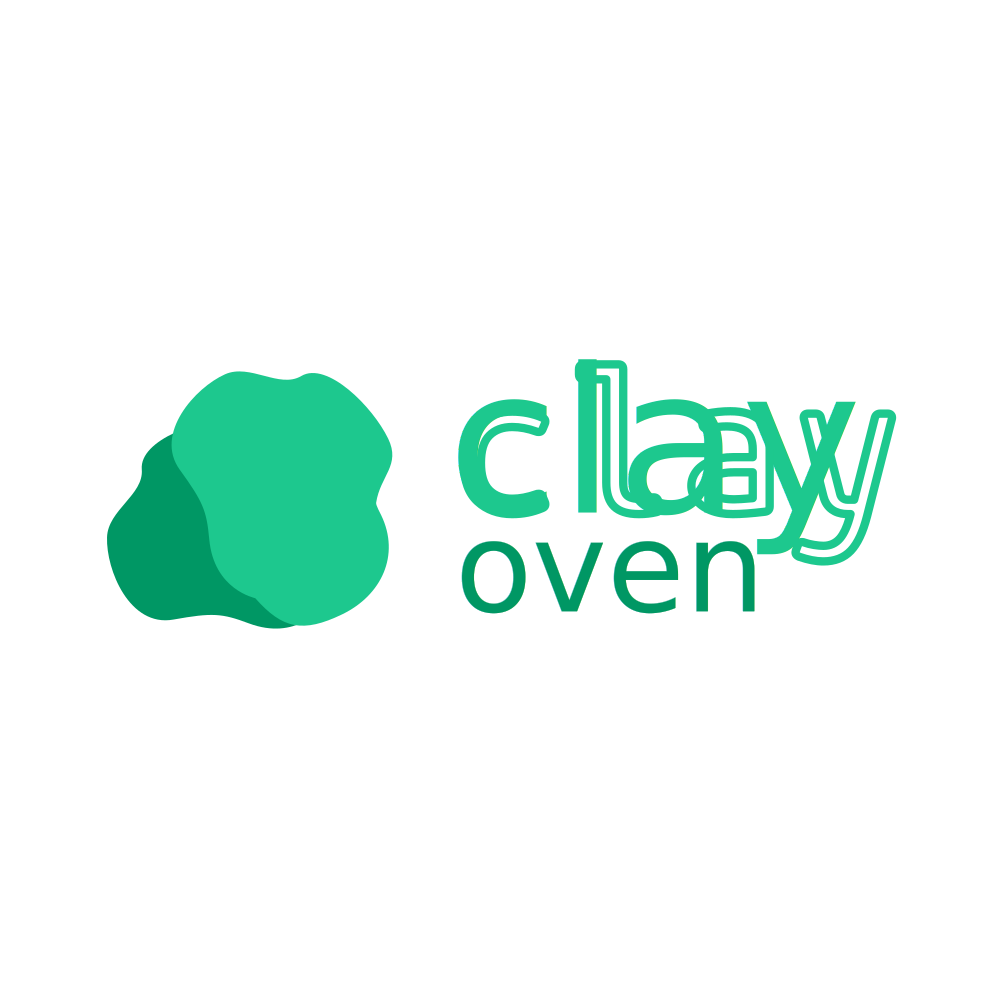

Clay is a documentation framework designed to help developers to speed up their development efforts
by providing a structured and auto-generated system for displaying documentation in a neat way.

## Capabilities
- Auto-generates [clay](https://github.com/clay-doc/clay) structure files based on your project files.
- Automatically adjusts clay bundles to allow the inclusion of configuration files.

## Usage
To use clay in your project you really only need the oven (this repository).
It will handle all the bundle management and distribution builds.

Here is a basic example of how you can set up your project with clay oven.
The following example structure demonstrates the simplicity of the clay tool:
```text
~
├── docs                             # Documentation directory
│   ├── my-doc.md                    # Documentation file (Markdown)
│   ├── my-other-doc.md              # Documentation file (Markdown)
│   └── my-sub-directory             # Sub-directory for organizing docs
│       ├── nested-doc.md            # Nested documentation file (Markdown)
│       └── another-nested-doc.md    # Nested documentation file (Markdown)
├── clay.yaml                        # Main configuration file
├── dir-meta.yaml                    # Directory meta file
└── logo.svg                         # Optional logo file
```

### Baking Process
In the above example, the `docs` directory contains your documentation files in Markdown format.
The `clay.yaml` file is the main configuration file for clay, where you can specify various settings for your documentation site.
The `dir-meta.yaml` file is an optional metadata file that allows you to customize folder names and icons in the generated clay structure.

During a clay oven baking process, the oven will:
1. Read your configuration file (clay.yaml by default).
2. Scan your documents directory (./docs by default) for files and folders.
3. Generate clay structure files based on the scanned files and folders.
4. Modify a clay distribution bundle to include the generated structure files and config.
5. Output the modified clay bundle to the specified output directory (./output by default).
6. Optionally overwrite existing files if the force flag is set.

There is the option to skip confirmation prompts when overwriting files by using the `-nc` flag.
This is useful for automated scripts or CI/CD pipelines such as GitHub Actions.

The above-mentioned `dir-meta.yaml` file is optional and allows you to specify custom names and icons for your documentation folders.
Here is an example for this meta file:
```yaml
- path: "my-directory"
  name: "My Directory"
  icon: "fa-solid fa-house"
  children:
    - path: "deeper-directory"
      name: "Even Deeper"
      icon: "fa-solid fa-briefcase"
      children:
```

This is fully optional, and if not provided, the oven will generate default names and icons for folders.

Details on the clay config can be found in the [clay](https://github.com/clay-doc/clay) repository.
A fully working example of a clay oven project can be found in the [clay-example-repo](https://github.com/clay-doc/clay-example-repo) repository.

### Arguments
Clay Oven accepts the following command line arguments to customize the build process:
```
-h help: Show help message
-c config: Specify path to config file (default: clay.yaml)
-d docs-dir: Specify path to documents directory (default: ./docs)
-o output: Specify output directory (default: ./output)
-fm folder-meta: Specify path to folder meta file (default: dir-meta.yaml)
-nc no-confirm: Do not ask for confirmation before overwriting files
```

