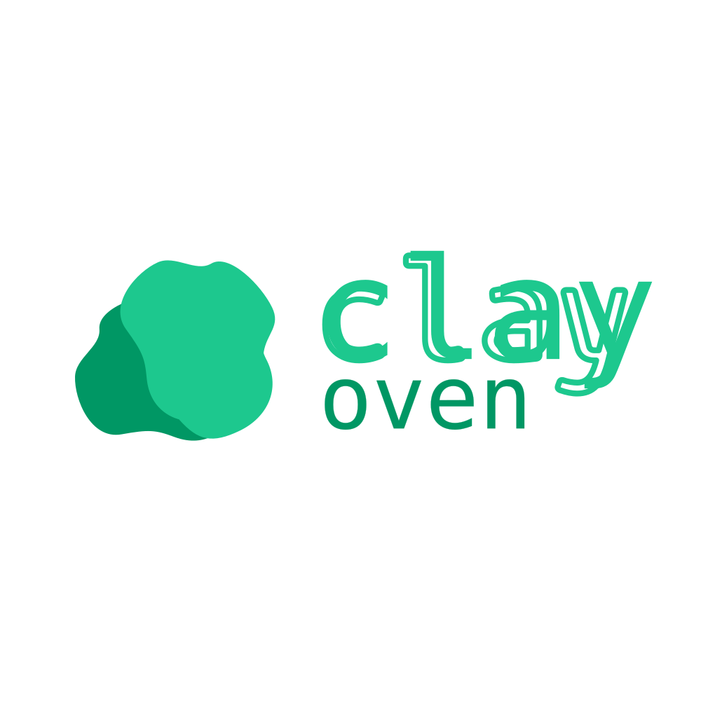

<p align="center">
  
</p>

<h1 align="center">Clay Oven</h1>

<p align="center">
  <strong>The build tool for <a href="https://github.com/clay-doc/clay">Clay</a> documentation sites.</strong>
</p>

<p align="center">
  <a href="https://github.com/clay-doc/clay-oven/releases/latest"></a>
  <a href="https://github.com/clay-doc/clay-oven/blob/main/LICENSE"></a>
</p>

---

Clay Oven is the build tool for the [Clay](https://github.com/clay-doc/clay) documentation framework. It auto-generates structure files from your project, bundles them with a Clay distribution, and outputs a ready-to-deploy documentation site.

## Quick Start
Once you have your project set up with a `clay.yaml` config and some documentation files, you can
use the clay-oven CLI to build your site.

Run Clay Oven directly via the provided installation script:

```bash
curl -fsSL https://raw.githubusercontent.com/clay-doc/clay-oven/refs/heads/main/run-oven.sh | sh
```

This downloads the appropriate binary for your platform and runs it.

## Supported Platforms

| Platform | Architecture          | Binary                          |
|----------|-----------------------|---------------------------------|
| Linux    | x86\_64               | `clay-oven-linux-amd64`         |
| Linux    | ARM64                 | `clay-oven-linux-arm64`         |
| macOS    | x86\_64               | `clay-oven-darwin-amd64`        |
| macOS    | ARM64 (Apple Silicon) | `clay-oven-darwin-arm64`        |
| Windows  | x86\_64               | `clay-oven-windows-amd64.exe`   |

## Project Structure

Below is a minimal example of a project using Clay Oven:

```text
.
├── docs/                    # Documentation directory
│   ├── my-doc.md            # Markdown documentation file
│   ├── my-other-doc.md
│   └── sub-directory/
│       ├── nested-doc.md
│       └── another-doc.md
├── clay.yaml                # Main configuration file
├── dir-meta.yaml            # Optional directory metadata
└── logo.svg                 # Optional logo
```

## How It Works

During a bake, Clay Oven will:

1. Read your configuration file (`clay.yaml` by default).
2. Scan the documents directory (`./docs` by default) for files and folders.
3. Generate Clay structure files from the scanned content.
4. Modify a Clay distribution bundle to include the generated structure and config.
5. Output the final bundle to the output directory (`./output` by default).

## CLI Arguments

| Flag   | Description                                              | Default          |
|--------|----------------------------------------------------------|------------------|
| `-h`   | Show help message                                        | —                |
| `-c`   | Path to config file                                      | `clay.yaml`      |
| `-d`   | Path to documents directory                              | `./docs`         |
| `-o`   | Output directory                                         | `./output`       |
| `-fm`  | Path to folder meta file                                 | `dir-meta.yaml`  |
| `-nc`  | Skip confirmation prompts before overwriting files       | —                |

> **Tip:** Use `-nc` in automated scripts or CI/CD pipelines (e.g. GitHub Actions) to skip interactive prompts.

## Environment Variables

You can override selected `clay.yaml` fields at build time using environment variables.
These overrides are applied **only to the build artifact** — the original config file is never modified.

| Variable               | Overrides         | Example                          |
|------------------------|-------------------|----------------------------------|
| `CLAY_TITLE`           | `title`           | `CLAY_TITLE="My Docs"`          |
| `CLAY_BASE_URL`        | `baseURL`         | `CLAY_BASE_URL="/docs"`         |
| `CLAY_FONTAWESOME_KIT` | `fontawesomeKit`  | `CLAY_FONTAWESOME_KIT="abc123"` |

During the build, Clay Oven will display which environment variables are set and prompt for
confirmation before applying them (unless `-nc` or `--ci` is used).

**Example:**

```bash
CLAY_BASE_URL="/my-project" CLAY_TITLE="My Project" clay-oven
```

## Directory Metadata

You can optionally provide a `dir-meta.yaml` file to customise folder display names and icons:

```yaml
- path: "my-directory"
  name: "My Directory"
  icon: "fa-solid fa-house"
  children:
    - path: "deeper-directory"
      name: "Even Deeper"
      icon: "fa-solid fa-briefcase"
      children:
```

If omitted, Clay Oven generates default names and icons automatically.

## Related

- [Clay](https://github.com/clay-doc/clay) — The documentation frontend framework.
- [Clay Example Repo](https://github.com/clay-doc/clay-example-repo) — A fully working example project.

## License

This project is licensed under the Apache License 2.0 — see [LICENSE](LICENSE) for details.

